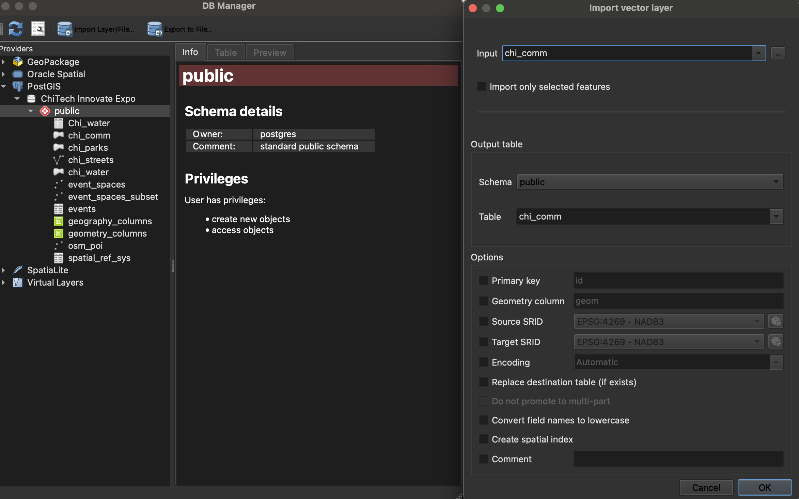
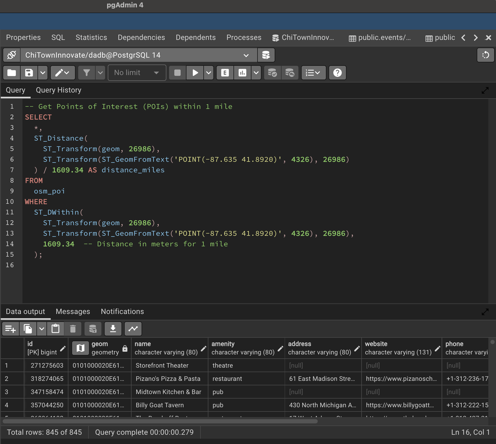
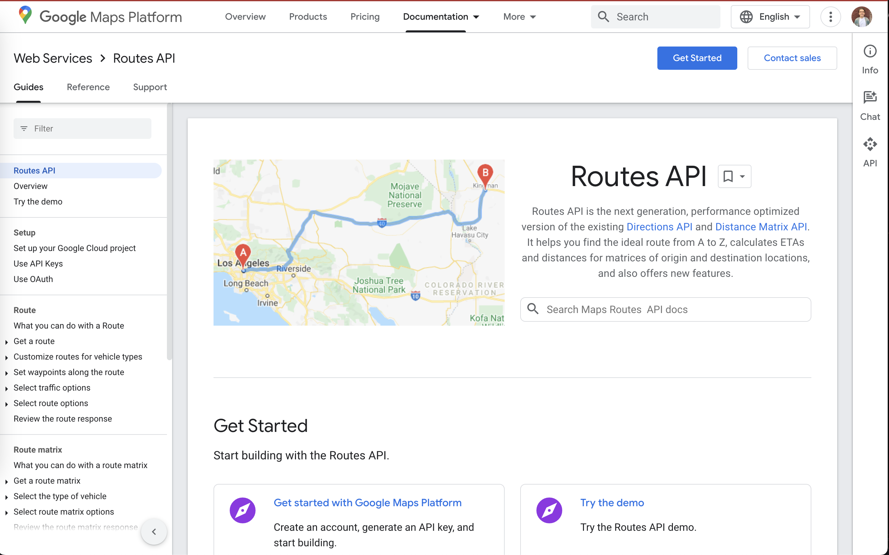
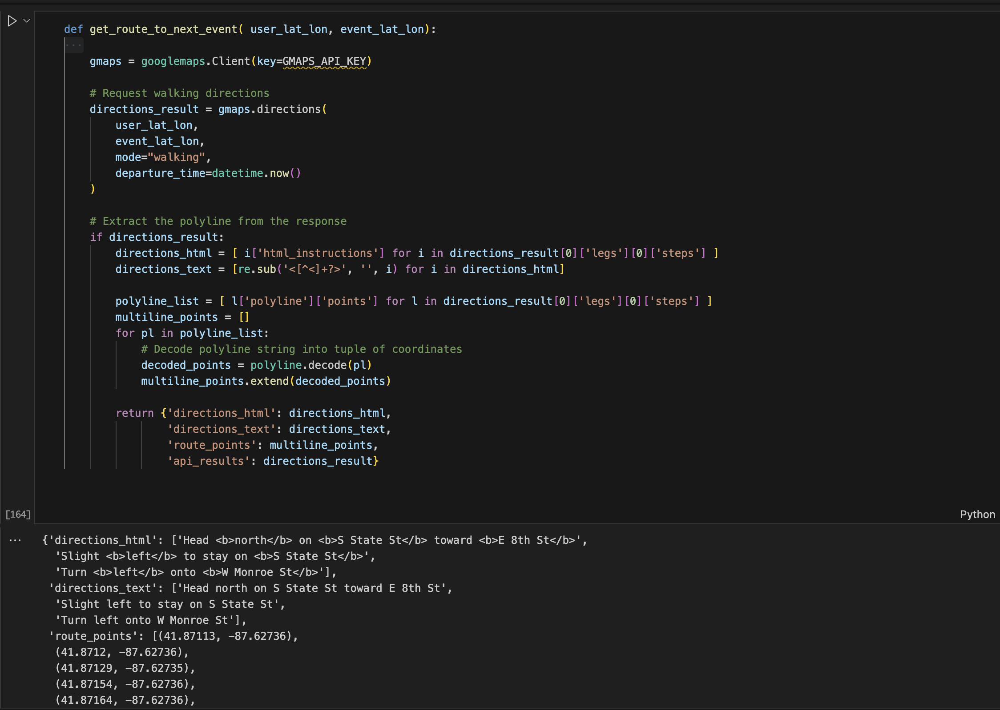
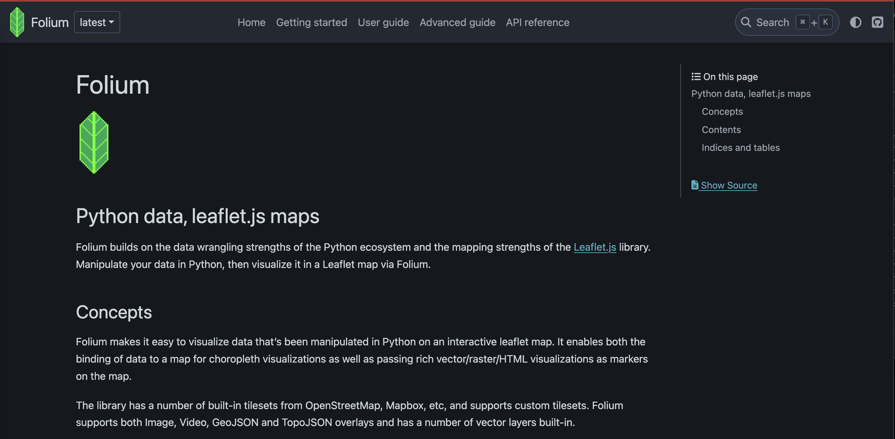
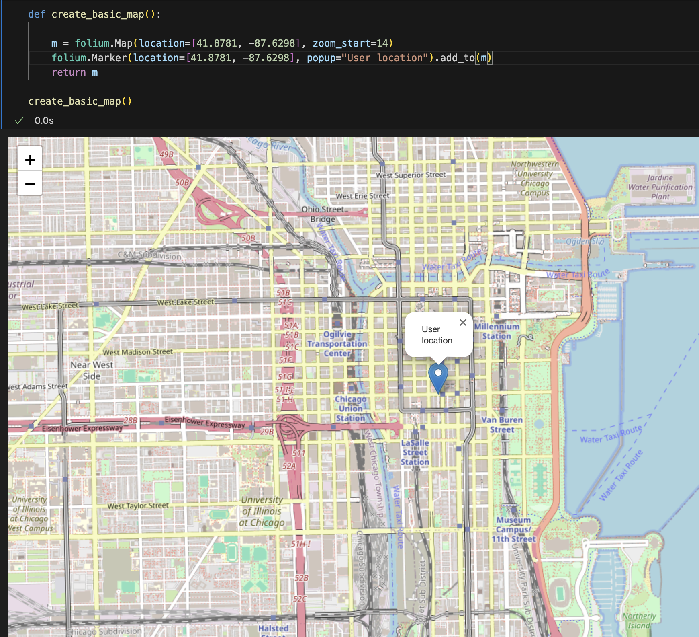
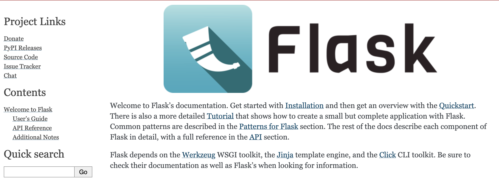
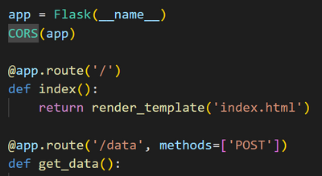

#### Final Project Walkthrough - Spatial Data Science Heinz CMU 2024
# A Proximity Point of Interest Routing Website for the _‘ChiTech Innovate Expo’_
#### By: Colton Lapp // Spring 2024

### Github Repo: [Link](https://github.com/colton-lapp/NearestPointOfInterest)

---

## Spatial Data Science Final Project Overview
**Setting:** A multi-day tech conference in September 2024 is hosted by the City of Chicago. The city hopes to provide a seemless and impressive experience for visitors by building a dedicated webpage for expo atendees

**Goal:** Develop a website that dynamically routes individual's to upcoming expo events and highlights local amenities

**Deliverable:** Python code that utilizes the cities database of events to dynamically route an individual to nearby events given their location and the time of day, highlighting points of interest and the city character in an interactive web map

**Environment:** The expo events and their associated conference centers are saved in a PostgreSQL database. The city has requested that an open source solution be developed which will integrate with existing systems. 

### Demo:

<figure>
    
    <figcaption><em>Demo of Dynamic Website Creation: A random location and time are generated, and then nearby points of interest and upcoming events are queried and displayed, alongside a walking route generated by the Google Maps API</em></figcaption>
</figure>

### Tools Used:
- **PostgreSQL / PostGIS** - storage of geospatial datasets
- **Folium** (Python package) - creation of .html web maps
- **Geopands / Shapely** (Python packages) - Geospatial analysis of geometries 
- **Google Maps API** - Used to retrieve routing directions
- **Open Street Map** - Scraped and saved points of interest, including bars, restaurants, cafes, and more
- **Flask** (Python package) - Used to build a website to generate and display the dyhamically created web maps
- **QGIS** - Used for exploratory data analysis of event spaces and for data loading
- **ChatGPT / DALLE** - Used to create logos, create fake event data, and for code assistance

---

### Procedure:
**Created and Retrieved Data**

- Scraped lat/lon and venue names for conference centers in Downtown Chicago from Google Maps
- Created fake tech event data in .csv format in ChatGPT
- Scraped and cleaned all point of interest data in Downtown Chicago from open street maps using a Python script
- Wrote Python function to create random location and time
- Downloaded Chicago shapefiles (streets, water, parks, neighborhoods) from public websites
- Generated logos using image generators

<figure>
    
    <figcaption><em>Visualization of Open Street Map's Bars in Chicago. This data, alongside other amenity types was downloaded and saved into the PostgreSQL database</em></figcaption>
</figure>

**Created PostgreSQL database and saved datasets**

- Used QGIS to load geospatial datasets into custom PostgreSQL database

<figure>
    
    <figcaption><em>Loading Datasets into PostgreSQL using QGIS</em></figcaption>
</figure>

**Visualized event, POI, shapefile data in QGIS**

<figure>
    
    <figcaption><em>Mapping the Open Street Maps Point of Interest Data, Chicago Shapefiles, and Scraped Conference Center Locations.</em></figcaption>
</figure>

**Wrote Spatial SQL code to query nearby POI, upcoming expo events and close by shapefiles**

- In Python, used Psycog2 package to connect to local PostgreSQL database. After generating random user location/time, queried the following:
	- Nearby Points of Interest (POI)
	- Upcoming events, joined to the event venue data
	- Nearby shapefiles 
        
<figure>
    
    <figcaption><em>Demonstrating Spatial SQL capabilities in PGAdmin.</em></figcaption>
</figure>

**Set up Google Maps API and wrote code to compute walking directions between user location and next expo event**

- Decoded google maps polystrings into multiline points for easier mapping

<figure>
    
    <figcaption><em>Google Maps API Webpage</em></figcaption>
</figure>

<figure>
    
    <figcaption><em>Example of Google Maps API code retrieving the route between two points.</em></figcaption>
</figure>

    
**Used Folium to create interactive HTML maps**

- Customized markers using html syntax and custom logos
- Customized popup displays using calculated information like distance, etc

<figure>
    
    <figcaption><em>Folium Homepage</em></figcaption>
</figure>
<figure>
    
    <figcaption><em>Basic Folium Map of Chicago with Popup</em></figcaption>
</figure>

**Used Flask to create a webapp for dynamic creation of maps**

- Wrapped all querying, analysis, and mapping code in a python script
- Built a basic webpage using Janja2 and Flask to allow user to trigger the generation of a random location/time and the recompiling of the map

     

<figure>
    
    <figcaption><em>Flask Homepage</em></figcaption>
</figure>
<figure>
    
    <figcaption><em>Example Flask Code to Create Website</em></figcaption>
</figure>

# Generated Map Demo:
[Link to demo of map](code/templates/map.html)
